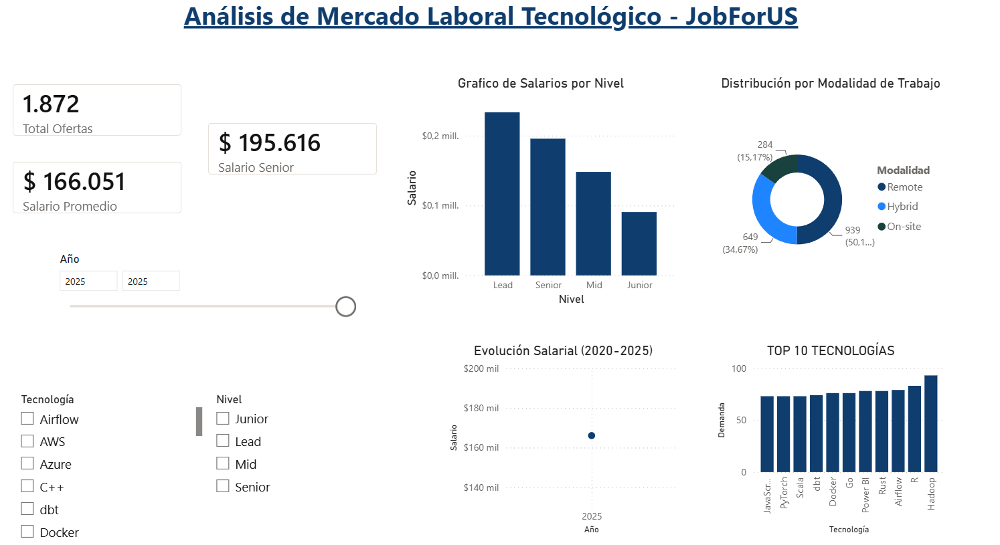
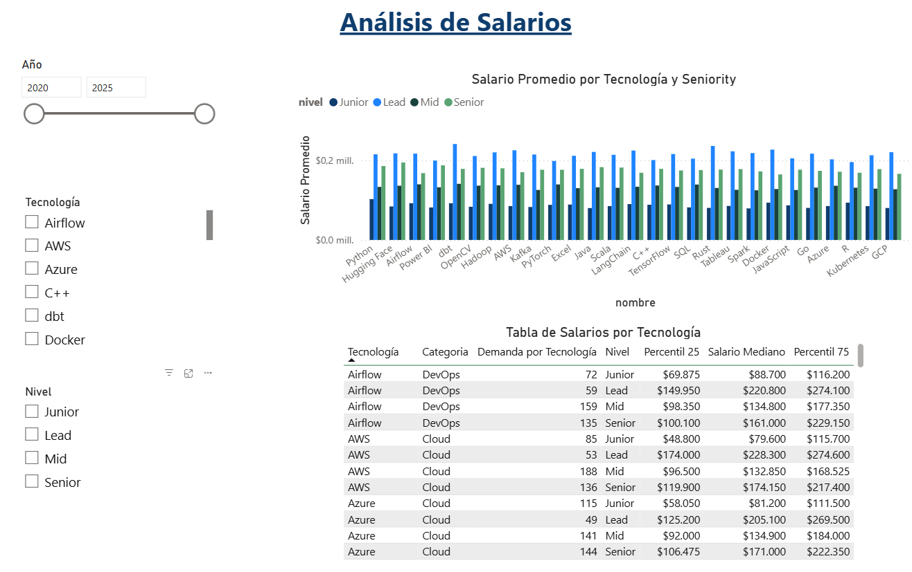
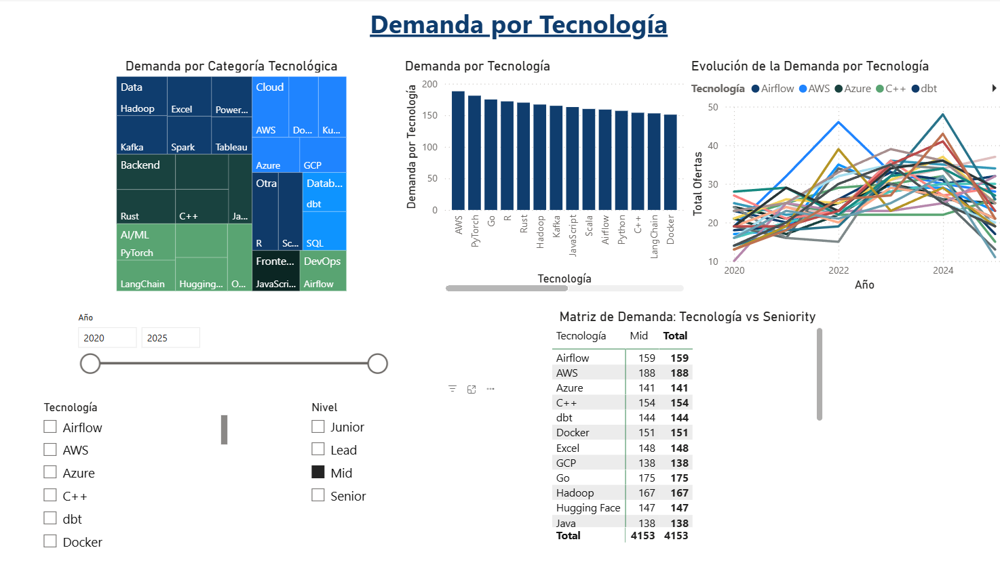
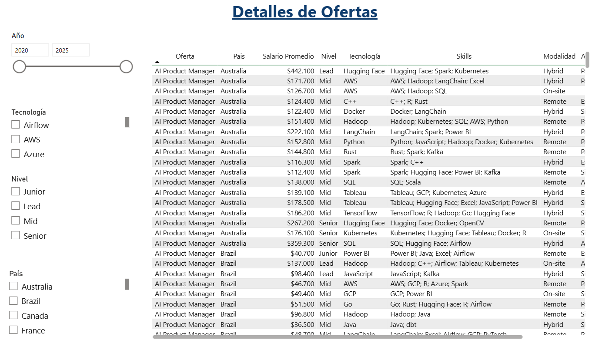

# 📊 JobsForUs

## 🎯 Título del Proyecto

**Sistema de Inteligencia de Negocios para el Análisis del Mercado Laboral Tecnológico**

---

## ❗ Problemática

Los estudiantes de Ingeniería de Sistemas enfrentan múltiples desafíos al momento de planificar su desarrollo profesional:

1. **Falta de información estructurada** sobre salarios reales del mercado para diferentes roles y niveles de experiencia.

2. **Desconocimiento de tendencias tecnológicas** actuales y futuras, lo que dificulta decidir qué lenguajes, frameworks o herramientas especializarse.

3. **Información dispersa y no confiable** proveniente de fuentes informales (comentarios de compañeros, grupos de WhatsApp, redes sociales) sin respaldo en datos reales.

4. **Brecha entre la formación académica** y lo que realmente demandan las empresas, generando egresados con habilidades desalineadas.

5. **Toma de decisiones subóptima** al momento de elegir especialización, primer empleo o negociación salarial.

Esta falta de inteligencia de mercado laboral impacta directamente en:
- Salarios iniciales por debajo del potencial real
- Mayor tiempo de inserción laboral
- Deserción temprana por expectativas no cumplidas
- Desajuste entre habilidades adquiridas y habilidades demandadas

---

## 🎯 Objetivo del Proyecto

**Objetivo General:**

Desarrollar un Sistema que analice ofertas laborales del sector tecnológico, para proporcionar a los estudiantes de Ingeniería de Sistemas información confiable, actualizada y accionable sobre salarios, tecnologías demandadas y tendencias del mercado.

**Objetivos Específicos:**

| # | Objetivo Específico | Indicador de éxito |
|---|---------------------|---------------------|
| 1 | Extraer y consolidar datos de al menos 1000 ofertas laborales del sector TI desde fuentes públicas disponibles en GitHub | Base de datos con registros limpios y normalizados |
| 2 | Clasificar las ofertas por rol, nivel de seniority, tecnologías requeridas y ubicación geográfica | Diccionario de clasificación con precisión >85% |
| 3 | Calcular estadísticas de salarios promedio, mediana y percentiles por combinación de rol y seniority | Tabla salarial con 15+ combinaciones |
| 4 | Identificar las 10 tecnologías más demandadas y su evolución en los últimos años | Ranking actualizado y gráfico de tendencias |
| 5 | Construir un dashboard interactivo que permita filtrar y visualizar los hallazgos clave | Dashboard funcional accesible vía web |
| 6 | Documentar todo el proceso (factibilidad, visión, requerimientos, arquitectura, informe final) | 5 documentos técnicos completos |

**Alcance del Proyecto:**

- ✅ Análisis de ofertas para roles técnicos (desarrollo, datos, infraestructura, seguridad)
- ✅ Incluye niveles Junior, Mid, Senior y Lead
- ✅ Datos provenientes de fuentes públicas (GitHub, Kaggle)
- ✅ Dashboard con filtros interactivos
- ❌ Excluye ofertas no técnicas (ventas, marketing, administrativo)
- ❌ Excluye scraping en tiempo real de portales (por restricciones legales)

---

## 🛠️ Tecnologías a Utilizar

| Componente | Tecnología | Propósito |
|------------|------------|-----------|
| Extracción | Python + Requests | Descarga de datasets desde GitHub |
| Transformación | Python + Pandas | Limpieza y normalización de datos |
| Almacenamiento | SQLite / PostgreSQL | Base de datos relacional |
| Visualización | Power BI | Dashboard interactivo |
| Control de versiones | GitHub | Repositorio del proyecto |

---

## Capturas del Dashoboard mediante PowerBI

**Resumen General**

**Análisis de Salarios**

**Demanda por Tecnología**

**Detalle de Ofertas**

